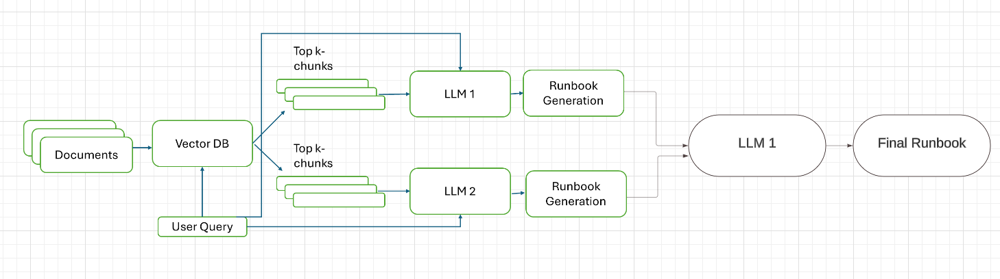
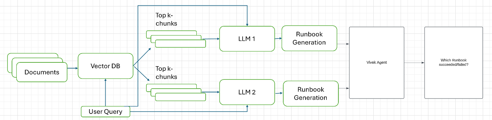

# RAG_LLM

## Public Demo Link
[]

## Setup Instructions

1. Clone this repository:
   ```bash
   git clone [repository URL]
   ```

2. Create a Python virtual environment:
   ```bash
   python3 -m venv venv
   ```

3. Activate the virtual environment:
   - On Unix or MacOS:
     ```bash
     source venv/bin/activate
     ```
   - On Windows:
     ```bash
     venv\Scripts\activate
     ```

4. Install dependencies:
   ```bash
   pip install -r requirements.txt
   ```

5. Set up the .env file:
   - Get your Groq API key from https://console.groq.com/keys
   - Add your API key to the `.env` file (refer to `.envExample` for the format)

6. Run the application:
   ```bash
   python3 app.py
   ```

This will start the local Gradio interface.

## Architecture

The project uses a methodology similar to boosting in machine learning, where multiple models create output. However, instead of a voting mechanism, intermediate outputs are used to create the final runbook.

Current Architecture


### Data Handling
- This is input folder currently consists of some documentaion from Databricks website and refernce book.
- Add relevant PDFs and text files to the `data` folder
- Currently supports only PDF and TXT files

### RAG Pipeline
1. Get relevant documents from user query
2. Run the query through two LLMs to get intermediate outputs
3. Provide relevant documents, intermediate outputs, and user query to the final LLM
4. Generate the final runbook

## Future Work

Future Architecture



1. Implement advanced RAG agents like Agentaic RAG or boosting mechanisms in RAG
2. Create a hallucination check:
   - Currently, there's no hallucination check
   - Sometimes the reference links may not exist
3. Integrate with Vivek agent:
   - Simulate tasks given in the runbook
   - Create an end-to-end pipeline
4. After integration:
   - Get feedback from the agent
   - Fine-tune LLM using LoRA or Adapter tuning
5. Expand tool and platform coverage:
   - Gather relevant data for other tools and platforms used by Solution Architects
